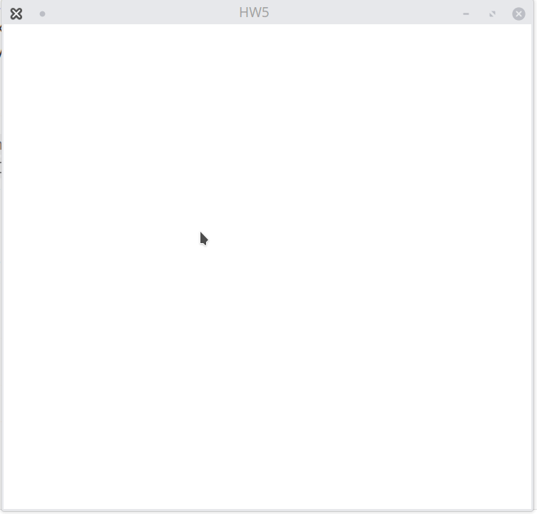

# ДЗ5 Заполнение многоугольника 
## Построить произвольный многоугольник и закрасить его
Сначала ЛКМ строится многоугольник против часов стрелки, по нажатию ПКМ достраивается последний отрезок и закрашивается многоугольник.

.
